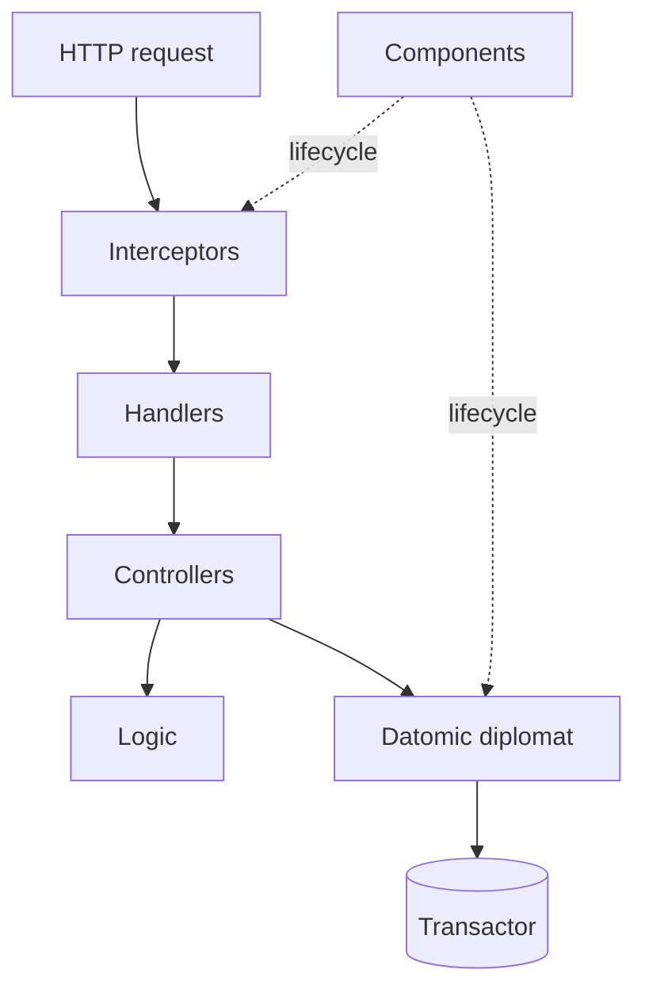

# clj-datomic-starter

A double-entry ledger written in Clojure on Datomic Pro. Small enough to
read end to end, opinionated enough to be useful as a reference for what
a Datomic-backed service can look like with hexagonal layering, system
components, and transactor-side invariants.

**71** tests across unit and integration · **8** schema norms · **6**
system components · **8** HTTP routes · pure-logic core, transactor
enforces balance.

## What's in the box

| Concern | Approach |
|---------|----------|
| Domain | `logic/` money, postings, entries, transfers. Pure, no I/O |
| Orchestration | `controllers/` speak business verbs: `open!`, `transfer!`, `balance` |
| Adapters | `diplomat/datomic/` and `diplomat/http_server/`, every conversation with the outside world |
| Lifecycle | `components/`, Stuart Sierra Component, started and stopped via `system.clj` |
| Validation | Malli at the HTTP boundary, attribute predicates and `:db.entity/attrs` inside the transactor |
| Atomicity | `:db/cas` on balances, classpath tx-fn for posting an entry, composite tuples for uniqueness |

## Architecture



Dependencies point inward. `logic/` knows nothing about Datomic or HTTP.
`diplomat/` is the only place that calls `datomic.api`. `controllers/`
glue the two without leaking either upward.

## Quickstart

Prerequisites: Docker, Docker Compose, a Datomic Pro license key.

```
export DATOMIC_LICENSE_KEY="..."
docker compose up
curl localhost:8080/health
```

The compose file brings up Postgres, Datomic storage, the transactor,
and the app. Metrics on `:9090/metrics`, Prometheus format.

## Local REPL

```
clj -M:dev:repl
```

Then:

```
(user/start)
(user/reset)
(user/open-portal)
```

`:dev` profile uses `datomic:dev://` and seeds from `resources/seed/dev.edn`.
`:test` profile uses `datomic:mem://` with no seed.

## HTTP surface

| Method | Path | Body |
|--------|------|------|
| GET    | `/health` | none |
| GET    | `/metrics` | none |
| POST   | `/v1/accounts` | open an account |
| POST   | `/v1/accounts/:id/close` | close |
| GET    | `/v1/customers/:id/accounts` | list by owner |
| POST   | `/v1/transfers` | move money between two accounts |
| POST   | `/v1/accounts/:id/balance` | as-of balance |
| POST   | `/v1/accounts/:id/movements` | windowed history |

JSON in, JSON out. Keys are kebab-case on the wire, an interceptor
renames them on the way in and out. Errors are `cognitect.anomalies`
mapped to HTTP status by the handler factory.

## Schema growth

`resources/schema/` is a numbered EDN sequence applied by an in-tree
migrator. New attributes go in a new file, nothing is ever rewritten.
Composite tuples (`0006`), attribute predicates (`0007`), and entity
specs (`0008`) live alongside the core attributes so the transactor
itself can refuse a malformed entry.

See `docs/schema-growth.md`.

## Tests

```
clj -X:test
clj -X:test:coverage
clj -M:long-test -X:test
```

Integration tests use `datomock` for cheap branching of an in-memory
connection. Helpers live in `test/.../helpers/`.

## Project layout

```
src/org/acme/ledger/
  system.clj              ; component graph, -main
  adapters/               ; anomalies, input coercion
  components/             ; config, datomic, http-server, metrics, migrator, routes
  controllers/            ; accounts, statements, transfers
  diplomat/datomic/       ; connection, query, tx, tx-fns, schema loader
  diplomat/http_server/   ; handlers, interceptors, json, routes
  logic/                  ; money, posting, entry, transfer
resources/
  config.edn              ; aero, profile-aware
  schema/                 ; numbered EDN norms
  tx-fns/                 ; classpath tx-fn defs
  seed/dev.edn
docs/
  architecture.md schema-growth.md transactions.md queries.md
  testing.md operations.md upgrade-path.md
```

## Configuration

`resources/config.edn` is read with aero. Profiles: `:dev`, `:test`, `:prod`.

| Variable | Used in | Default |
|----------|---------|---------|
| `LEDGER_PROFILE` | system entry point | `prod` |
| `LEDGER_HTTP_PORT` | http-server | `8080` |
| `LEDGER_HTTP_HOST` | http-server | `0.0.0.0` |
| `LEDGER_METRICS_PORT` | metrics | `9090` |
| `LEDGER_DATOMIC_URI` | datomic component (`:prod`) | required |
| `LEDGER_LOG_LEVEL` | timbre | `:info` |
| `DATOMIC_LICENSE_KEY` | transactor (compose) | required |

## Docs

- `docs/architecture.md`, layers and request lifecycle
- `docs/schema-growth.md`, how to add and evolve attributes
- `docs/transactions.md`, tx-fns, `:db/cas`, balanced entries
- `docs/queries.md`, pull, datalog, history
- `docs/testing.md`, datomock, fixtures, state-flow
- `docs/operations.md`, backup, log rotation, transactor sizing
- `docs/upgrade-path.md`, swapping the migrator or validator

## License

MIT.
