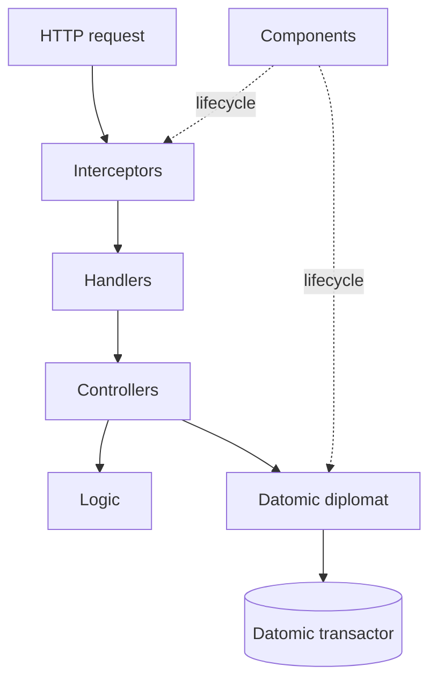

# Architecture

The service is organized as four concentric layers. Each layer has a single
responsibility, and dependencies always point inward.

## Layers

- **logic/**: pure functions. Money arithmetic, balanced entries, transfer-to-entry translation. No I/O, no Datomic, no HTTP.
- **controllers/**: orchestration. Translate input shapes into logic calls, then into transactions or queries. Speak business language: `open!`, `transfer!`, `balance`.
- **diplomat/**: every conversation with the outside world. `diplomat/datomic/` holds tx, query, and tx-fn implementations. `diplomat/http_server/` holds Pedestal interceptors, routes, JSON encoders, and the handler factory.
- **components/**: lifecycle and wiring. Each component implements `start`/`stop`. The system map in `system.clj` declares dependencies between them.

## Request lifecycle

1. Pedestal Jetty receives the request.
2. The interceptor chain attaches a correlation ID, validates the body with Malli, and exposes the runtime dependency map to the handler.
3. The handler calls a controller. The controller is a plain function: `(fn [{:keys [request datomic metrics]}] result)`.
4. The controller calls into `logic/` for pure decisions, then into `diplomat/datomic/tx` to commit. Every transaction carries `:tx/correlation-id`, `:tx/actor`, and `:tx/source`.
5. The handler factory turns the controller's return into an HTTP response. Anomalies become structured error payloads with the correct status.
